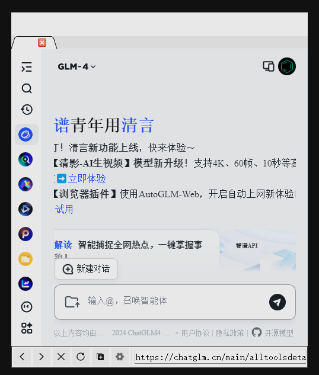
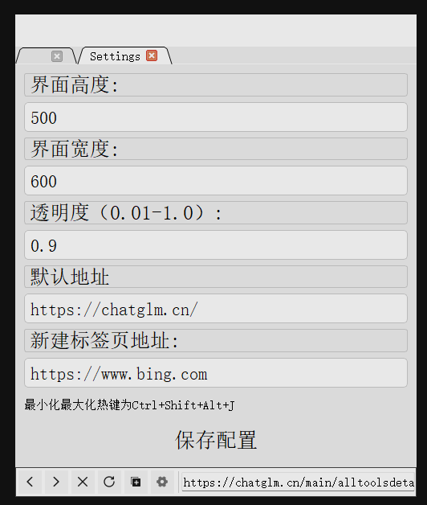

# 半透明迷你桌面浏览器

---

此软件免安装，使用`Python`编写，基于`PyQt`，实现了一个小型的浏览器，可以新建页面、前进后退、刷新、停止加载等基本功能，日常可以用来在写代码的时候随时询问ai，而不用随时切换IDE和浏览器。

主界面如下：

设置按钮配置如下：

界面大小只有再下次进入时才会刷新，其他配置信息实时刷新。

---

此软件会规避截屏，（不然截屏的时候总是截到它很难受），鼠标在进入页面范围内后，页面透明度会变为配置中的透明度，离开页面范围后会变为0.01。默认地址可以填入一个你喜欢的ai，（实测ChatGPT不可以使用，暂时未解决），新建标签页默认设为bing引擎，也可以修改为Google、Baidu等。

软件尚未完善，待完善完整后会全部开源，代码较为简单。
